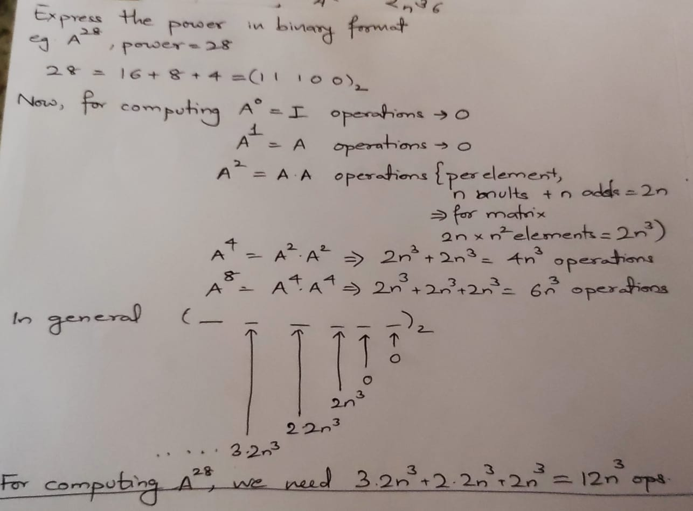

# Solutions to zeroth assignment 

Q2. Let An×n be a given square matrix. Compute the number of multiplications
and additions required to evaluate A28 using

a. $A^2 = A \times A; A^4 = A^2 \times A^2$


b. The naive method, A28 = A · A · · · A
> Per multiplication it is $2n^3$, so for 28 multiplications, it would be $27 \times 2n^3 = 54n^3$ operations.
---

Q4. Write a code to implement d digit significant arithmetic and solve the following system and compare the results for d = 2, 3, 4, 5 by eliminating one of the variables?

$$
0.1036x_1 + 0.2122x_2 = 0.7381
0.2081x_1 + 0.4247x_2 = 0.9327
$$

Do you think that the solution would change if we interchange the two equations? Compare by Tabulating the results.

Refer `sol_4.py` for code. Tabulating the results below

```
Augmented Representation:
[[0.1036 0.2122 0.7381]
 [0.2081 0.4247 0.9327]]
Significant digits: 5| Solution: [-722.65247029  356.29074422]
Augmented Representation:
[[0.1036 0.2122 0.7381]
 [0.2081 0.4247 0.9327]]
Significant digits: 4| Solution: [-722.65247029  356.29074422]
Augmented Representation:
[[0.104 0.212 0.738]
 [0.208 0.425 0.933]]
Significant digits: 3| Solution: [1113.98076923 -543.        ]
Augmented Representation:
[[0.1  0.21 0.74]
 [0.21 0.42 0.93]]
Significant digits: 2| Solution: [-55.          29.71428571]


Reversing the rows
Augmented Representation:
[[0.2081 0.4247 0.9327]
 [0.1036 0.2122 0.7381]]
Significant digits: 5| Solution: [-722.65247029  356.29074422]
Augmented Representation:
[[0.2081 0.4247 0.9327]
 [0.1036 0.2122 0.7381]]
Significant digits: 4| Solution: [-722.65247029  356.29074422]
Augmented Representation:
[[0.208 0.425 0.933]
 [0.104 0.212 0.738]]
Significant digits: 3| Solution: [1113.98076923 -543.        ]
Augmented Representation:
[[0.21 0.42 0.93]
 [0.1  0.21 0.74]]
Significant digits: 2| Solution: [-55.          29.71428571]
```

Significant digits do play a very important role in determining the exact solutions of a given system of equations. It is best to use double precision when handling these to avoid round off errors which can magnify significantly later on.